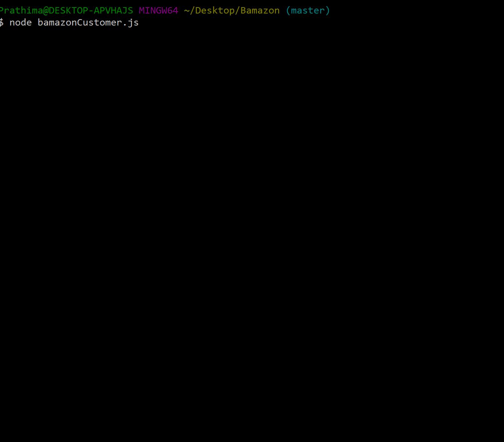
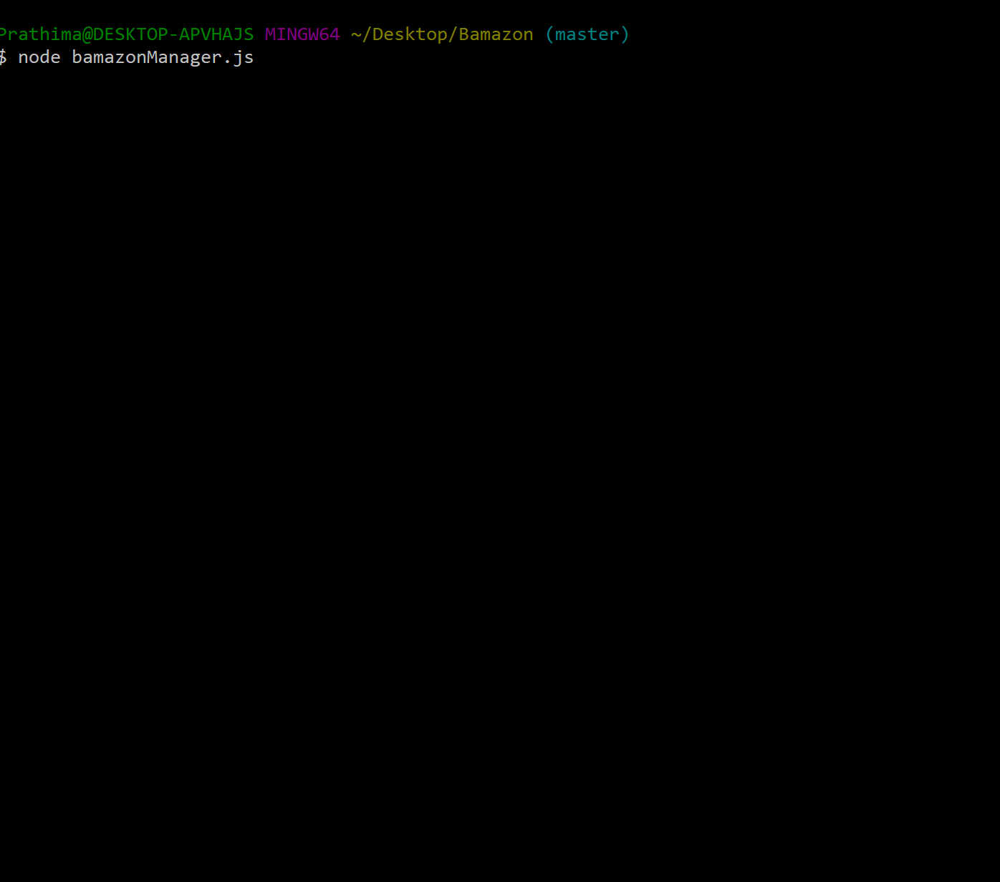

# Bamazon :This is an app similar to Amazon.
Bamazon will take in orders from customers and deplete stock from the store's inventory.
Customer View:
Receives orders from customers via the command line and interfaces with mySQL to deplete stock from the store's inventory.
bamazonManager View:
Mimics the basics of a warehouse management system, providing managers with a list of options to view stock and adjust inventory.
A sample of the menu is below: 
View Products for Sale
View Low Inventory
Add to Inventory
Add New Product
bamazonExecutive View:
Simulates very basic profit and sales insights for upper management.
A sample of the menu is below: 
View Product Sales by Department
Create New Department

Below is the Demo of Customer View:

Below is the Demo of Manager View:

Below is the Demo of Executive View:

